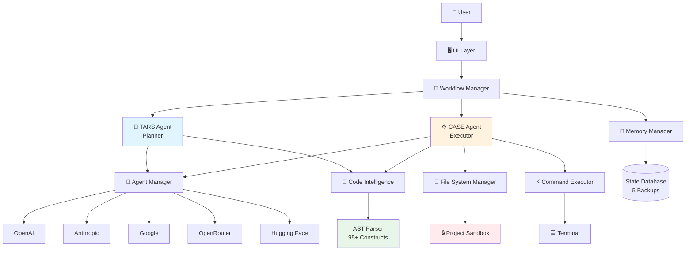
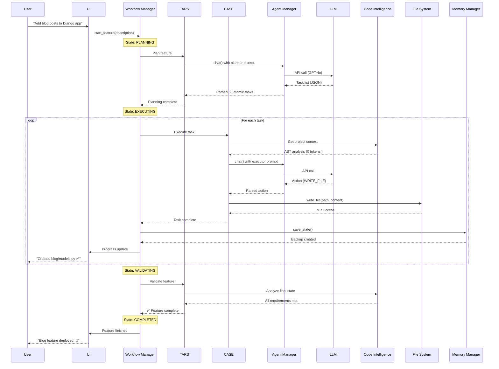
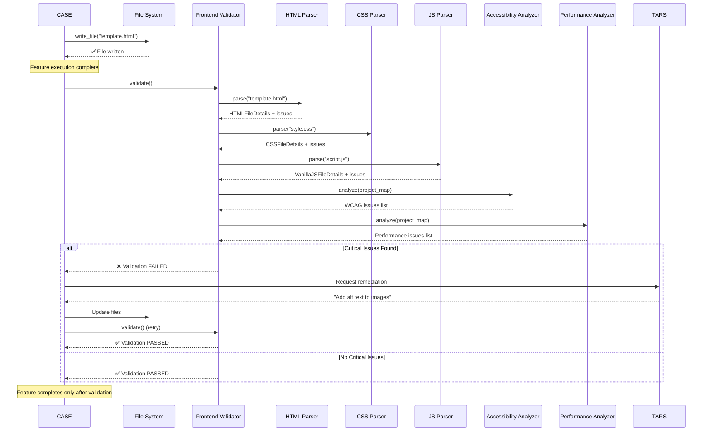
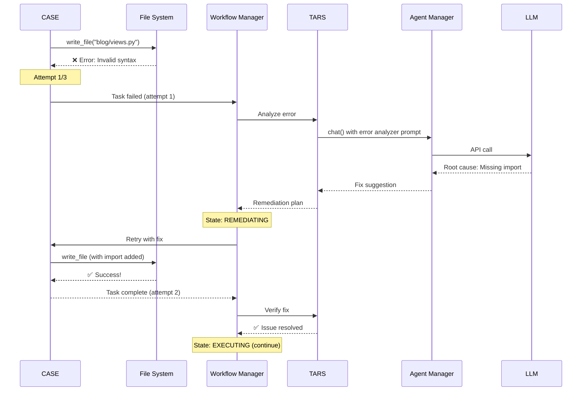

# 🏗️ VebGen Architecture Documentation

> **Central hub for VebGen's technical architecture** - Complete system overview, component catalog, data flow diagrams, and developer onboarding guide.

---

## 📋 Table of Contents

- [System Overview](#-system-overview)
- [Core Architecture](#-core-architecture)
- [Component Catalog](#-component-catalog)
- [Data Flow Diagrams](#-data-flow-diagrams)
- [Technology Stack](#-technology-stack)
- [Component Dependencies](#-component-dependencies)
- [Getting Started for Developers](#-getting-started-for-developers)

---

## 🎯 System Overview

**VebGen** is an **autonomous AI development framework** that uses a **dual-agent architecture** (TARS + CASE) to transform natural language requirements into production-ready web applications. The system operates with **zero-token AST parsing**, **military-grade security**, and **continuous state persistence**.

### Key Architectural Principles

1. **Dual-Agent Orchestration** - TARS (planner) and CASE (executor) work together like a real dev team
2. **Zero-Token Intelligence** - AST parsing analyzes code without consuming API tokens
3. **Sandboxed Execution** - All file operations restricted to project root with path validation
4. **Command Whitelisting** - 50+ safe commands pre-approved, dangerous patterns blocked
5. **Continuous State Persistence** - 5 rolling backups with SHA-256 verification
6. **Plugin Architecture** - Framework-specific prompts loaded dynamically (Django, Flask, Node.js)
7. **Multi-Provider Support** - 120+ models across OpenAI, Anthropic, Google, OpenRouter, Hugging Face
8. **Frontend Quality Enforcement (v0.3.0)** - WCAG 2.1 compliance and Lighthouse-style performance checks built-in

---

## 🏛️ Core Architecture

VebGen is organized into **7 architectural layers**:

```text
┌─────────────────────────────────────────────────────────────┐
│ Layer 1: User Interface │
│ main_window.py - user_action_dialog.py - tooltip.py │
└─────────────────────────────────────────────────────────────┘
 ↓↑
┌─────────────────────────────────────────────────────────────┐
│ Layer 2: Orchestration Layer │
│ workflow_manager.py - agent_manager.py │
└─────────────────────────────────────────────────────────────┘
 ↓↑
┌─────────────────────────────────────────────────────────────┐
│ Layer 3: AI Agent Layer │
│ adaptive_agent.py (CASE) - adaptive_prompts.py (rules) │
└─────────────────────────────────────────────────────────────┘
 ↓↑
┌─────────────────────────────────────────────────────────────┐
│ Layer 4: Intelligence Services │
│ code_intelligence_service.py - context_manager.py - │
│ memory_manager.py - project_models.py │
└─────────────────────────────────────────────────────────────┘
 ↓↑
┌─────────────────────────────────────────────────────────────┐
│ Layer 4.5: Frontend Validation Layer 🆕 (v0.3.0) │
│ frontend_validator.py - parsers/ - analyzers/ - validators/│
└─────────────────────────────────────────────────────────────┘
 ↓↑
┌─────────────────────────────────────────────────────────────┐
│ Layer 5: Infrastructure Layer │
│ file_system_manager.py - command_executor.py - │
│ secure_storage.py - config_manager.py │
└─────────────────────────────────────────────────────────────┘
 ↓↑
┌─────────────────────────────────────────────────────────────┐
│ Layer 6: External Integration Layer │
│ llm_client.py - openai_client.py - anthropic_client.py - │
│ google_genai_client.py - hf_client.py - providers.json │
└─────────────────────────────────────────────────────────────┘
```

### Layer Responsibilities

#### Layer 1: User Interface (182 KB)
**Purpose**: Desktop application GUI built with CustomTkinter

- **main_window.py** (182 KB) - Main application window with real-time progress display
- **user_action_dialog.py** (7.7 KB) - Modal dialog for manual terminal commands
- **tooltip.py** (4.4 KB) - Hover hints for UI elements (500ms delay)

#### Layer 2: Orchestration (162 KB)
**Purpose**: Coordinates TARS/CASE workflow and manages LLM communication

- **workflow_manager.py** (157 KB) - Dual-agent orchestration, 13 feature states, remediation loops
- **agent_manager.py** (20 KB) - LLM client factory, provider switching, unified chat interface

#### Layer 3: AI Agents (87 KB)
**Purpose**: Executes AI-driven development tasks

- **adaptive_agent.py** (67 KB) - CASE execution loop with 9 actions (WRITE_FILE, RUN_COMMAND, etc.)
- **adaptive_prompts.py** (27 KB) - Framework-specific workflow rules (Django: 11 steps, Flask: 7 steps, Node: 8 steps)

#### Layer 4: Intelligence Services (220 KB - includes frontend validation)
**Purpose**: Provides zero-token code analysis, state management, and frontend quality enforcement

**Backend Intelligence:**
- **code_intelligence_service.py** (109 KB) - AST parser for 95+ Django constructs + frontend files
- **context_manager.py** (21 KB) - Token optimization with 3-tier pruning
- **memory_manager.py** (49 KB) - State persistence with 5 rolling backups
- **project_models.py** (35 KB) - Pydantic schemas for features, tasks, errors

**Frontend Intelligence (v0.3.0 🆕):**
- **frontend_validator.py** (6.7 KB) - Validation orchestration
- **parsers/** (37 KB) - HTMLParser, CSSParser, VanillaJSParser
- **analyzers/** (11 KB) - Accessibility + Performance analysis
- **validators/** (4.6 KB) - Cross-file integrity checks

#### Layer 4.5: Frontend Validation (NEW in v0.3.0) (45 KB)
**Purpose**: Enforces WCAG 2.1 and production-grade frontend quality

- **frontend_validator.py** (6.7 KB) - Orchestrates 7 validators, blocks features with critical issues
- **parsers/** (37 KB) - HTMLParser (13 KB), CSSParser (11 KB), VanillaJSParser (12 KB)
- **analyzers/** (11 KB) - AccessibilityAnalyzer (4 KB), PerformanceAnalyzer (7 KB)
- **validators/** (11 KB) - JSHTMLValidator (4.6 KB) for cross-file integrity

#### Layer 5: Infrastructure (174 KB)
**Purpose**: Secure file operations, command execution, configuration

- **file_system_manager.py** (58 KB) - Sandbox operations, unified diff patching, rollback
- **command_executor.py** (91 KB) - Whitelist validation, blocklist filtering, venv detection
- **secure_storage.py** (10 KB) - OS keyring integration for API key encryption
- **config_manager.py** (16 KB) - Plugin discovery and framework prompt loading

#### Layer 6: External Integration (50 KB)
**Purpose**: Multi-provider LLM integration

- **llm_client.py** (17 KB) - Base client with unified ChatMessage interface
- **openai_client.py** (5 KB) - OpenAI GPT-4, GPT-4o integration
- **anthropic_client.py** (6 KB) - Claude Opus/Sonnet integration
- **google_genai_client.py** (8 KB) - Gemini 2.0/2.5 integration
- **hf_client.py** (14 KB) - Hugging Face model integration
- **providers.json** (4 KB) - Configuration for 120+ models

---

## 📚 Component Catalog

Complete list of all documented components with sizes, purposes, and links to detailed documentation.

### Core Components

| Component | File Size | Purpose | Documentation |
|-----------|-----------|---------|---------------|
| **Workflow Manager** | 142 KB | Orchestrates TARS/CASE dual-agent workflow with 13 feature states and remediation loops | [📖 Docs](workflow_manager.md) |
| **Adaptive Agent** | 61 KB | CASE execution loop with 9 actions, content management, error recovery | [📖 Docs](adaptive_agent.md) |
| **Code Intelligence Service** | 106 KB | AST parser for 95+ Django constructs, zero-token analysis, caching | [📖 Docs](code_intelligence_service.md) |
| **File System Manager** | 58 KB | Sandbox operations, unified diff patching, rollback, fuzzy file matching | [📖 Docs](file_system_manager.md) |
| **Command Executor** | 91 KB | Whitelist validation (50+ commands), blocklist filtering, venv detection | [📖 Docs](command_executor.md) |
| **Memory Manager** | 49 KB | State persistence with 5 rolling backups, SHA-256 verification, atomic writes | [📖 Docs](memory_manager.md) |
| **Agent Manager** | 20 KB | LLM client orchestration, provider switching, unified chat interface | [📖 Docs](agent_manager.md) |

### Configuration & Storage

| Component | File Size | Purpose | Documentation |
|-----------|-----------|---------|---------------|
| **Config Manager** | 16 KB | Plugin discovery, framework prompt loading, validation | [📖 Docs](config_manager.md) |
| **Secure Storage** | 10 KB | OS keyring integration, API key encryption (Windows/Linux/macOS) | [📖 Docs](secure_storage.md) |
| **Providers Configuration** | 4 KB | JSON config for 120+ models across 5 providers | [📖 Docs](providers.md) |
| **Project Models** | 35 KB | Pydantic schemas for features, tasks, errors, memory (13 models) | [📖 Docs](project_models.md) |

### LLM Integration

| Component | File Size | Purpose | Documentation |
|-----------|-----------|---------|---------------|
| **LLM Clients** | 50 KB | 5 client implementations (OpenAI, Anthropic, Google, OpenRouter, HF) | [📖 Docs](llm_clients.md) |
| **Context Manager** | 21 KB | Token optimization with 3-tier pruning (FULL → COMPACT → MINIMAL) | [📖 Docs](context_manager.md) |

### Framework Intelligence

| Component | File Size | Purpose | Documentation |
|-----------|-----------|---------|---------------|
| **Framework Prompts** | 166 KB | Django expert prompts (166 KB), Flask/React/Node placeholders | [📖 Docs](framework_prompts.md) |
| **Adaptive Prompts** | 6 KB | Workflow checklists for Django (11 steps), Flask (7), Node.js (8) | [📖 Docs](adaptive_prompts.md) |

### Frontend Validation Components (v0.3.0 🆕)

| Component | File Size | Purpose | Documentation |
|-----------|-----------|---------|---------------|
| **Frontend Validator** | 6.7 KB | Orchestrates HTML/CSS/JS validation, enforces WCAG 2.1 compliance | [📖 Docs](frontend_validator.md) |
| **HTML Parser** | 13 KB | Parses HTML for semantic structure, forms, accessibility issues | [📖 Docs](html_parser.md) |
| **CSS Parser** | 11 KB | Validates CSS for WCAG compliance, responsive design, BEM | [📖 Docs](css_parser.md) |
| **Vanilla JS Parser** | 12 KB | Analyzes JavaScript for security issues, API calls, DOM patterns | [📖 Docs](vanilla_js_parser.md) |
| **Accessibility Analyzer** | 4 KB | Maps HTML/CSS issues to WCAG 2.1 criteria | [📖 Docs](analyzers.md) |
| **Performance Analyzer** | 7 KB | Lighthouse-style audits for render-blocking, dead code, page weight | [📖 Docs](analyzers.md) |
| **JS-HTML Validator** | 4.6 KB | Cross-file integrity checks (orphaned selectors, broken refs) | [📖 Docs](js_html_validator.md) |

### UI Components

| Component | File Size | Purpose | Documentation |
|-----------|-----------|---------|---------------|
| **UI Components** | 194 KB | Main window, manual command dialog, tooltips (CustomTkinter) | [📖 Docs](ui_components.md) |

**Total Documentation**: 900+ KB across 21 detailed technical documents

---

## 🔄 Data Flow Diagrams

### High-Level System Architecture



### Feature Development Flow



### Frontend Validation Flow (v0.3.0 🆕)



### Error Recovery Flow



### Command Execution Security Flow

```mermaid
graph TD
CASE[CASE Agent] --> CE[Command Executor]

CE --> VE[Venv Detection]
VE --> WL{Whitelist<br/>Check}

WL -->|Not in whitelist| Block1[❌ BLOCKED]
WL -->|In whitelist| BL{Blocklist<br/>Check}

BL -->|Matches pattern| Block2[❌ BLOCKED]
BL -->|Safe| ST{Shell Token<br/>Validation}

ST -->|Has ; | & $ `| Block3[❌ BLOCKED]
ST -->|Clean| PA{Path<br/>Validation}

PA -->|Outside project| Block4[❌ BLOCKED]
PA -->|Within project| EX[✅ Execute]

Block1 --> Log[📝 Log Security Event]
Block2 --> Log
Block3 --> Log
Block4 --> Log

EX --> Result{Exit Code}
Result -->|0| Success[✅ Return Output]
Result -->|Non-zero| Error[❌ Return Error]

style Block1 fill:#ffcdd2
style Block2 fill:#ffcdd2
style Block3 fill:#ffcdd2
style Block4 fill:#ffcdd2
style Success fill:#c8e6c9
style Error fill:#fff9c4
```

---

## 🛠️ Technology Stack

### Core Technologies

| Technology | Version | Purpose |
|------------|---------|---------|
| **Python** | 3.10+ | Core language |
| **CustomTkinter** | Latest | Desktop UI framework |
| **AST (Python)** | Built-in | Code parsing without tokens |
| **Pydantic** | 2.x | Data validation and schemas |
| **keyring** | Latest | Secure API key storage |
| **pathlib** | Built-in | Path manipulation |
| **subprocess** | Built-in | Command execution |
| **json** | Built-in | Configuration files |
| **logging** | Built-in | Application logging |
| **BeautifulSoup4** | Latest | HTML parsing for frontend validation |
| **esprima** | Latest | JavaScript AST parsing |
| **re (regex)** | Built-in | CSS selector extraction |

### LLM Integrations

| Provider | Library | Models |
|----------|---------|--------|
| **OpenAI** | `openai` | GPT-4o, GPT-4-turbo, GPT-4o-mini |
| **Anthropic** | `anthropic` | Claude Opus 4, Sonnet 3.7/4, Haiku 3.5 |
| **Google** | `google-generativeai` | Gemini 2.0 Flash, Gemini 2.5 Pro |
| **OpenRouter** | `openai` (API) | 100+ models via unified API |
| **Hugging Face** | `huggingface_hub` | Open-source models |

### Development Tools

| Tool | Purpose |
|------|---------|
| **pytest** | Unit testing (309 passing tests) |
| **pyproject.toml** | Project configuration |
| **Git** | Version control |
| **Mermaid** | Architecture diagrams |

---

## 🔗 Component Dependencies

### Workflow Manager Dependencies

```text
workflow_manager.py (157 KB)
├── adaptive_agent.py # CASE execution
├── agent_manager.py # LLM communication
├── memory_manager.py # State persistence
├── code_intelligence_service.py # AST analysis
├── file_system_manager.py # File operations
├── project_models.py # Pydantic schemas
├── config_manager.py # Framework prompts
└── frontend_validator.py # Frontend quality validation (v0.3.0)
```

### Adaptive Agent Dependencies

```text
adaptive_agent.py (67 KB)
├── agent_manager.py # LLM chat interface
├── file_system_manager.py # WRITE_FILE, DELETE_FILE
├── command_executor.py # RUN_COMMAND
├── code_intelligence_service.py # Context retrieval
├── context_manager.py # Token optimization
└── project_models.py # TaskAction, ExecutionResult
```

### Agent Manager Dependencies

```text
agent_manager.py (20 KB)
├── llm_client.py # Base client interface
├── openai_client.py # OpenAI integration
├── anthropic_client.py # Anthropic integration
├── google_genai_client.py # Google integration
├── hf_client.py # Hugging Face integration
├── config_manager.py # Provider configuration
└── providers.json # Model list
```

### File System Manager Dependencies

```text
file_system_manager.py (58 KB)
├── memory_manager.py # State backups
├── project_models.py # Snapshot schema
└── (no external deps) # Pure Python + pathlib
```

### Code Intelligence Service Dependencies

```text
code_intelligence_service.py (109 KB)
├── ast (Python built-in) # AST parsing
├── project_models.py # CodeContext schema
└── (no external deps) # Zero-token analysis
```

### Frontend Validator Dependencies (v0.3.0)

```text
frontend_validator.py (6.7 KB)
├── parsers/html_parser.py # HTML validation
├── parsers/css_parser.py # CSS validation
├── parsers/vanilla_js_parser.py # JS validation
├── analyzers/accessibility_analyzer.py # WCAG mapping
├── analyzers/performance_analyzer.py # Lighthouse checks
├── validators/js_html_validator.py # Cross-file integrity
└── project_models.py # FrontendValidationIssue schema
```

### HTML/CSS/JS Parser Dependencies

```text
parsers/ (37 KB total)
├── html_parser.py (13 KB)
│ ├── BeautifulSoup4 # HTML parsing
│ └── project_models.py # HTMLFileDetails
├── css_parser.py (11 KB)
│ ├── re (regex) # Selector extraction
│ └── project_models.py # CSSFileDetails
└── vanilla_js_parser.py (12 KB)
├── esprima # JavaScript AST
└── project_models.py # VanillaJSFileDetails
```

### Analyzer Dependencies

```text
analyzers/ (11 KB total)
├── accessibility_analyzer.py (4 KB)
│ └── project_models.py # FrontendValidationIssue
└── performance_analyzer.py (7 KB)
└── project_models.py # FrontendValidationIssue
```

### Command Executor Dependencies

```text
command_executor.py (91 KB)
├── subprocess # Command execution
├── pathlib # Path validation
└── command_blocklist.json # Dangerous patterns
```

### Memory Manager Dependencies

```text
memory_manager.py (49 KB)
├── project_models.py # MemorySchema
├── hashlib # SHA-256 verification
└── pathlib # File I/O
```

### Frontend Validator Dependencies (NEW in v0.3.0)

```text
frontend_validator.py (6.7 KB)
├── parsers/html_parser.py # HTML structure analysis
├── parsers/css_parser.py # CSS analysis
├── parsers/vanilla_js_parser.py # JavaScript analysis
├── analyzers/accessibility_analyzer.py # WCAG 2.1 compliance
├── analyzers/performance_analyzer.py # Core Web Vitals
└── validators/js_html_validator.py # Cross-file integrity
```

---

## 🚀 Getting Started for Developers

### Recommended Reading Order

Follow this sequence to understand VebGen's architecture from high-level concepts to implementation details:

#### Phase 1: Big Picture (Start Here!)

1. **README.md** - Project overview, features, quick start
2. **ARCHITECTURE.md** - This file (you are here!)
3. **workflow_manager.md** - How TARS/CASE work together (142 KB deep dive)

**Time**: 30-45 minutes | **Outcome**: Understand VebGen's dual-agent architecture

---

#### Phase 2: Core Mechanics

4. **adaptive_agent.md** - CASE execution loop, 9 actions, content management
5. **agent_manager.md** - LLM integration, provider switching
6. **code_intelligence_service.md** - AST parsing magic (zero tokens!)
7. **🆕 frontend_validator.md** - WCAG 2.1 validation orchestration (v0.3.0)

**Time**: 90-120 minutes | **Outcome**: Understand task execution, LLM communication, and frontend quality enforcement

---

#### Phase 3: Safety & Storage

7. **file_system_manager.md** - Sandbox system, patching, rollback
8. **command_executor.md** - Command whitelisting and security
9. **memory_manager.md** - State persistence with 5 backups
10. **secure_storage.md** - API key encryption (OS keyring)

**Time**: 60-90 minutes | **Outcome**: Understand security model and data persistence

---

#### Phase 4: Configuration & Customization

11. **config_manager.md** - Plugin system and framework loading
12. **framework_prompts.md** - Django prompts (166 KB!)
13. **adaptive_prompts.md** - Workflow checklists (Django/Flask/Node)
14. **providers.md** - 120+ models configuration

**Time**: 45-60 minutes | **Outcome**: Understand how to add new frameworks and models

---

#### Phase 5: Advanced Topics

15. **context_manager.md** - Token optimization (3-tier pruning)
16. **project_models.md** - Pydantic schemas (13 models)
17. **llm_clients.md** - 5 LLM client implementations
18. **ui_components.md** - Desktop UI (CustomTkinter)

**Time**: 45-60 minutes | **Outcome**: Master advanced features and UI implementation

---

### Quick Start Paths

#### "I want to understand the dual-agent system"
→ Read: **workflow_manager.md** + **adaptive_agent.md** + **agent_manager.md**

#### "I want to add a new framework (FastAPI, Laravel, etc.)"
→ Read: **config_manager.md** + **framework_prompts.md** + **adaptive_prompts.md**

#### "I want to understand the security model"
→ Read: **file_system_manager.md** + **command_executor.md** + **secure_storage.md**

#### "I want to add a new LLM provider"
→ Read: **llm_clients.md** + **agent_manager.md** + **providers.md**

#### "I want to understand state management"
→ Read: **memory_manager.md** + **project_models.md** + **workflow_manager.md** (state machine section)

#### "I want to understand frontend validation (WCAG/accessibility)"
→ Read: **frontend_validator.md** + **html_parser.md** + **css_parser.md** + **analyzers.md**

---

## 📊 Key Metrics

### Codebase Statistics

| Metric | Value |
|--------|-------|
| **Total Python Code** | ~900 KB (+100 KB frontend validation) |
| **Total Documentation** | 1,000+ KB (+150 KB for v0.3.0) |
| **Core Components** | 34 files (+7 frontend validation) |
| **Unit Tests** | 356 passing tests (+47 frontend tests) |
| **Test Modules** | 28 test files (+8 frontend test modules) |
| **Django Constructs Supported** | 95+ (backend) + 100+ (frontend rules) |
| **WCAG Criteria Covered** | 12+ (v0.3.0 NEW) |
| **Frontend File Types Analyzed** | HTML, CSS, JavaScript (v0.3.0 NEW) |
| **Supported Models** | 120+ |
| **LLM Providers** | 5 |
| **Framework Plugins** | 4 (Django, Flask, React, Node) |
| **Security Rules** | 50+ whitelist + 30+ blocklist patterns |
| **State Backups** | 5 rolling backups |

### Performance Characteristics

| Operation | Performance |
|-----------|-------------|
| **AST Parsing** | 0 tokens (free, instant) |
| **Context Loading** | 200-800 tokens (optimized) |
| **File Operations** | Sandboxed, atomic |
| **State Backup** | 5 copies with SHA-256 verification |
| **Command Execution** | Whitelist validation &lt; 1ms |
| **Memory Footprint** | ~150 MB typical |

---

## 🤝 Contributing to Architecture

### Adding New Components

When adding new components to VebGen:

1. **Create the component** in appropriate layer (`core/`, `ui/`, `plugins/`)
2. **Write comprehensive docs** (follow existing `.md` templates)
3. **Update this ARCHITECTURE.md** with:
   - Component catalog entry
   - Dependency tree
   - Data flow diagram (if applicable)
4. **Update README.md** with documentation link
5. **Write unit tests** (minimum 80% coverage)

### Documentation Standards

All component documentation should include:

- **Overview** - What the component does (1-2 sentences)
- **Architecture** - How it works (detailed)
- **API Reference** - All public methods
- **Examples** - Real-world usage
- **Testing** - Unit test examples
- **Troubleshooting** - Common issues

---

## 📞 Need Help?

- **GitHub Issues**: Report bugs or request features
- **GitHub Discussions**: Ask architecture questions
- **Documentation**: All 15 detailed `.md` files in `docs/` directory

---

<div align="center">

**VebGen Architecture** - 900+ KB of technical documentation  
**Built with ❤️ by Ramesh Ravada**

🏠 Back to README | 📚 Component Docs | 🚀 Quick Start

</div>