# 🏗️ VebGen Architecture Documentation

> **Central hub for VebGen's technical architecture** - Complete system overview, component catalog, data flow diagrams, and developer onboarding guide.

---

## 📋 Table of Contents

- [System Overview](#-system-overview)
- [Core Architecture](#-core-architecture)
- [Component Catalog](#-component-catalog)
- [Data Flow Diagrams](#-data-flow-diagrams)
- [Technology Stack](#-technology-stack)
- [Component Dependencies](#-component-dependencies)
- [Getting Started for Developers](#-getting-started-for-developers)

---

## 🎯 System Overview

**VebGen** is an **autonomous AI development framework** that uses a **dual-agent architecture** (TARS + CASE) to transform natural language requirements into production-ready web applications. The system operates with **zero-token AST parsing**, **military-grade security**, and **continuous state persistence**.

### Key Architectural Principles

1. **Dual-Agent Orchestration** - TARS (planner) and CASE (executor) work together like a real dev team
2. **Zero-Token Intelligence** - AST parsing analyzes code without consuming API tokens
3. **Sandboxed Execution** - All file operations restricted to project root with path validation
4. **Command Whitelisting** - 50+ safe commands pre-approved, dangerous patterns blocked
5. **Continuous State Persistence** - 5 rolling backups with SHA-256 verification
6. **Plugin Architecture** - Framework-specific prompts loaded dynamically (Django, Flask, Node.js)
7. **Multi-Provider Support** - 120+ models across OpenAI, Anthropic, Google, OpenRouter, Hugging Face

---

## 🏛️ Core Architecture

VebGen is organized into **6 architectural layers**:

```text
┌─────────────────────────────────────────────────────────────┐
│ Layer 1: User Interface │
│ main_window.py - user_action_dialog.py - tooltip.py │
└─────────────────────────────────────────────────────────────┘
 ↓↑
┌─────────────────────────────────────────────────────────────┐
│ Layer 2: Orchestration Layer │
│ workflow_manager.py - agent_manager.py │
└─────────────────────────────────────────────────────────────┘
 ↓↑
┌─────────────────────────────────────────────────────────────┐
│ Layer 3: AI Agent Layer │
│ adaptive_agent.py (CASE) - adaptive_prompts.py (rules) │
└─────────────────────────────────────────────────────────────┘
 ↓↑
┌─────────────────────────────────────────────────────────────┐
│ Layer 4: Intelligence Services │
│ code_intelligence_service.py - context_manager.py - │
│ memory_manager.py - project_models.py │
└─────────────────────────────────────────────────────────────┘
 ↓↑
┌─────────────────────────────────────────────────────────────┐
│ Layer 5: Infrastructure Layer │
│ file_system_manager.py - command_executor.py - │
│ secure_storage.py - config_manager.py │
└─────────────────────────────────────────────────────────────┘
 ↓↑
┌─────────────────────────────────────────────────────────────┐
│ Layer 6: External Integration Layer │
│ llm_client.py - openai_client.py - anthropic_client.py - │
│ google_genai_client.py - hf_client.py - providers.json │
└─────────────────────────────────────────────────────────────┘
```

### Layer Responsibilities

#### Layer 1: User Interface (182 KB)
**Purpose**: Desktop application GUI built with CustomTkinter

- **main_window.py** (182 KB) - Main application window with real-time progress display
- **user_action_dialog.py** (7.7 KB) - Modal dialog for manual terminal commands
- **tooltip.py** (4.4 KB) - Hover hints for UI elements (500ms delay)

#### Layer 2: Orchestration (162 KB)
**Purpose**: Coordinates TARS/CASE workflow and manages LLM communication

- **workflow_manager.py** (142 KB) - Dual-agent orchestration, 13 feature states, remediation loops
- **agent_manager.py** (20 KB) - LLM client factory, provider switching, unified chat interface

#### Layer 3: AI Agents (87 KB)
**Purpose**: Executes AI-driven development tasks

- **adaptive_agent.py** (61 KB) - CASE execution loop with 9 actions (WRITE_FILE, RUN_COMMAND, etc.)
- **adaptive_prompts.py** (26 KB) - Framework-specific workflow rules (Django: 11 steps, Flask: 7 steps, Node: 8 steps)

#### Layer 4: Intelligence Services (175 KB)
**Purpose**: Provides zero-token code analysis and state management

- **code_intelligence_service.py** (106 KB) - AST parser for 95+ Django constructs, caching
- **context_manager.py** (21 KB) - Token optimization with 3-tier pruning strategy
- **memory_manager.py** (49 KB) - State persistence with 5 rolling backups, SHA-256 verification
- **project_models.py** (35 KB) - Pydantic schemas for features, tasks, errors (13 models)

#### Layer 5: Infrastructure (174 KB)
**Purpose**: Secure file operations, command execution, configuration

- **file_system_manager.py** (58 KB) - Sandbox operations, unified diff patching, rollback
- **command_executor.py** (91 KB) - Whitelist validation, blocklist filtering, venv detection
- **secure_storage.py** (10 KB) - OS keyring integration for API key encryption
- **config_manager.py** (16 KB) - Plugin discovery and framework prompt loading

#### Layer 6: External Integration (50 KB)
**Purpose**: Multi-provider LLM integration

- **llm_client.py** (17 KB) - Base client with unified ChatMessage interface
- **openai_client.py** (5 KB) - OpenAI GPT-4, GPT-4o integration
- **anthropic_client.py** (6 KB) - Claude Opus/Sonnet integration
- **google_genai_client.py** (8 KB) - Gemini 2.0/2.5 integration
- **hf_client.py** (14 KB) - Hugging Face model integration
- **providers.json** (4 KB) - Configuration for 120+ models

---

## 📚 Component Catalog

Complete list of all documented components with sizes, purposes, and links to detailed documentation.

### Core Components

| Component | File Size | Purpose | Documentation |
|-----------|-----------|---------|---------------|
| **Workflow Manager** | 142 KB | Orchestrates TARS/CASE dual-agent workflow with 13 feature states and remediation loops | [📖 Docs](workflow_manager.md) |
| **Adaptive Agent** | 61 KB | CASE execution loop with 9 actions, content management, error recovery | [📖 Docs](adaptive_agent.md) |
| **Code Intelligence Service** | 106 KB | AST parser for 95+ Django constructs, zero-token analysis, caching | [📖 Docs](code_intelligence_service.md) |
| **File System Manager** | 58 KB | Sandbox operations, unified diff patching, rollback, fuzzy file matching | [📖 Docs](file_system_manager.md) |
| **Command Executor** | 91 KB | Whitelist validation (50+ commands), blocklist filtering, venv detection | [📖 Docs](command_executor.md) |
| **Memory Manager** | 49 KB | State persistence with 5 rolling backups, SHA-256 verification, atomic writes | [📖 Docs](memory_manager.md) |
| **Agent Manager** | 20 KB | LLM client orchestration, provider switching, unified chat interface | [📖 Docs](agent_manager.md) |

### Configuration & Storage

| Component | File Size | Purpose | Documentation |
|-----------|-----------|---------|---------------|
| **Config Manager** | 16 KB | Plugin discovery, framework prompt loading, validation | [📖 Docs](config_manager.md) |
| **Secure Storage** | 10 KB | OS keyring integration, API key encryption (Windows/Linux/macOS) | [📖 Docs](secure_storage.md) |
| **Providers Configuration** | 4 KB | JSON config for 120+ models across 5 providers | [📖 Docs](providers.md) |
| **Project Models** | 35 KB | Pydantic schemas for features, tasks, errors, memory (13 models) | [📖 Docs](project_models.md) |

### LLM Integration

| Component | File Size | Purpose | Documentation |
|-----------|-----------|---------|---------------|
| **LLM Clients** | 50 KB | 5 client implementations (OpenAI, Anthropic, Google, OpenRouter, HF) | [📖 Docs](llm_clients.md) |
| **Context Manager** | 21 KB | Token optimization with 3-tier pruning (FULL → COMPACT → MINIMAL) | [📖 Docs](context_manager.md) |

### Framework Intelligence

| Component | File Size | Purpose | Documentation |
|-----------|-----------|---------|---------------|
| **Framework Prompts** | 166 KB | Django expert prompts (166 KB), Flask/React/Node placeholders | [📖 Docs](framework_prompts.md) |
| **Adaptive Prompts** | 6 KB | Workflow checklists for Django (11 steps), Flask (7), Node.js (8) | [📖 Docs](adaptive_prompts.md) |

### UI Components

| Component | File Size | Purpose | Documentation |
|-----------|-----------|---------|---------------|
| **UI Components** | 194 KB | Main window, manual command dialog, tooltips (CustomTkinter) | [📖 Docs](ui_components.md) |

**Total Documentation**: 850+ KB across 15 detailed technical documents

---

## 🔄 Data Flow Diagrams

### High-Level System Architecture

```mermaid
graph TB
User[👤 User] --> UI[🖥️ UI Layer]
UI --> WM[🎯 Workflow Manager]

WM --> TARS[🧠 TARS Agent<br/>Planner]
WM --> CASE[⚙️ CASE Agent<br/>Executor]

TARS --> AM[🔌 Agent Manager]
CASE --> AM

AM --> LLM1[OpenAI]
AM --> LLM2[Anthropic]
AM --> LLM3[Google]
AM --> LLM4[OpenRouter]
AM --> LLM5[Hugging Face]

CASE --> FSM[📁 File System Manager]
CASE --> CE[⚡ Command Executor]

FSM --> Sandbox[🔒 Project Sandbox]
CE --> Terminal[💻 Terminal]

TARS --> CIS[🧬 Code Intelligence]
CASE --> CIS
CIS --> AST[AST Parser<br/>95+ Constructs]

WM --> MM[💾 Memory Manager]
MM --> DB[(State Database<br/>5 Backups)]

style TARS fill:#e1f5ff
style CASE fill:#fff3e0
style AST fill:#e8f5e9
style Sandbox fill:#ffebee
```



### Feature Development Flow

```mermaid
sequenceDiagram
participant User
participant UI
participant WM as Workflow Manager
participant TARS
participant CASE
participant AM as Agent Manager
participant LLM
participant CIS as Code Intelligence
participant FSM as File System
participant MM as Memory Manager

User->>UI: "Add blog posts to Django app"
UI->>WM: start_feature(description)

Note over WM: State: PLANNING
WM->>TARS: Plan feature
TARS->>AM: chat() with planner prompt
AM->>LLM: API call (GPT-4o)
LLM-->>AM: Task list (JSON)
AM-->>TARS: Parsed 50 atomic tasks
TARS-->>WM: Planning complete

Note over WM: State: EXECUTING
loop For each task
    WM->>CASE: Execute task
    CASE->>CIS: Get project context
    CIS-->>CASE: AST analysis (0 tokens!)
    CASE->>AM: chat() with executor prompt
    AM->>LLM: API call
    LLM-->>AM: Action (WRITE_FILE)
    AM-->>CASE: Parsed action
    CASE->>FSM: write_file(path, content)
    FSM-->>CASE: ✅ Success
    CASE-->>WM: Task complete
    WM->>MM: save_state()
    MM-->>WM: Backup created
    WM->>UI: Progress update
    UI-->>User: "Created blog/models.py ✅"
end

Note over WM: State: VALIDATING
WM->>TARS: Validate feature
TARS->>CIS: Analyze final state
CIS-->>TARS: All requirements met
TARS-->>WM: ✅ Feature complete

Note over WM: State: COMPLETED
WM->>UI: Feature finished
UI-->>User: "Blog feature deployed! 🎉"
```



### Error Recovery Flow

```mermaid
sequenceDiagram
participant CASE
participant FSM as File System
participant WM as Workflow Manager
participant TARS
participant AM as Agent Manager
participant LLM

CASE->>FSM: write_file("blog/views.py")
FSM-->>CASE: ❌ Error: Invalid syntax

Note over CASE: Attempt 1/3
CASE->>WM: Task failed (attempt 1)
WM->>TARS: Analyze error
TARS->>AM: chat() with error analyzer prompt
AM->>LLM: API call
LLM-->>AM: Root cause: Missing import
AM-->>TARS: Fix suggestion
TARS-->>WM: Remediation plan

Note over WM: State: REMEDIATING
WM->>CASE: Retry with fix
CASE->>FSM: write_file (with import added)
FSM-->>CASE: ✅ Success!

CASE-->>WM: Task complete (attempt 2)
WM->>TARS: Verify fix
TARS-->>WM: ✅ Issue resolved

Note over WM: State: EXECUTING (continue)
```



### Command Execution Security Flow

```mermaid
graph TD
CASE[CASE Agent] --> CE[Command Executor]

CE --> VE[Venv Detection]
VE --> WL{Whitelist<br/>Check}

WL -->|Not in whitelist| Block1[❌ BLOCKED]
WL -->|In whitelist| BL{Blocklist<br/>Check}

BL -->|Matches pattern| Block2[❌ BLOCKED]
BL -->|Safe| ST{Shell Token<br/>Validation}

ST -->|Has ; | & $ `| Block3[❌ BLOCKED]
ST -->|Clean| PA{Path<br/>Validation}

PA -->|Outside project| Block4[❌ BLOCKED]
PA -->|Within project| EX[✅ Execute]

Block1 --> Log[📝 Log Security Event]
Block2 --> Log
Block3 --> Log
Block4 --> Log

EX --> Result{Exit Code}
Result -->|0| Success[✅ Return Output]
Result -->|Non-zero| Error[❌ Return Error]

style Block1 fill:#ffcdd2
style Block2 fill:#ffcdd2
style Block3 fill:#ffcdd2
style Block4 fill:#ffcdd2
style Success fill:#c8e6c9
style Error fill:#fff9c4
```

---

## 🛠️ Technology Stack

### Core Technologies

| Technology | Version | Purpose |
|------------|---------|---------|
| **Python** | 3.10+ | Core language |
| **CustomTkinter** | Latest | Desktop UI framework |
| **AST (Python)** | Built-in | Code parsing without tokens |
| **Pydantic** | 2.x | Data validation and schemas |
| **keyring** | Latest | Secure API key storage |
| **pathlib** | Built-in | Path manipulation |
| **subprocess** | Built-in | Command execution |
| **json** | Built-in | Configuration files |
| **logging** | Built-in | Application logging |

### LLM Integrations

| Provider | Library | Models |
|----------|---------|--------|
| **OpenAI** | `openai` | GPT-4o, GPT-4-turbo, GPT-4o-mini |
| **Anthropic** | `anthropic` | Claude Opus 4, Sonnet 3.7/4, Haiku 3.5 |
| **Google** | `google-generativeai` | Gemini 2.0 Flash, Gemini 2.5 Pro |
| **OpenRouter** | `openai` (API) | 100+ models via unified API |
| **Hugging Face** | `huggingface_hub` | Open-source models |

### Development Tools

| Tool | Purpose |
|------|---------|
| **pytest** | Unit testing (309 passing tests) |
| **pyproject.toml** | Project configuration |
| **Git** | Version control |
| **Mermaid** | Architecture diagrams |

---

## 🔗 Component Dependencies

### Workflow Manager Dependencies

```text
workflow_manager.py (142 KB)
├── adaptive_agent.py # CASE execution
├── agent_manager.py # LLM communication
├── memory_manager.py # State persistence
├── code_intelligence_service.py # AST analysis
├── file_system_manager.py # File operations
├── project_models.py # Pydantic schemas
└── config_manager.py # Framework prompts
```

### Adaptive Agent Dependencies

```text
adaptive_agent.py (61 KB)
├── agent_manager.py # LLM chat interface
├── file_system_manager.py # WRITE_FILE, DELETE_FILE
├── command_executor.py # RUN_COMMAND
├── code_intelligence_service.py # Context retrieval
├── context_manager.py # Token optimization
└── project_models.py # TaskAction, ExecutionResult
```

### Agent Manager Dependencies

```text
agent_manager.py (20 KB)
├── llm_client.py # Base client interface
├── openai_client.py # OpenAI integration
├── anthropic_client.py # Anthropic integration
├── google_genai_client.py # Google integration
├── hf_client.py # Hugging Face integration
├── config_manager.py # Provider configuration
└── providers.json # Model list
```

### File System Manager Dependencies

```text
file_system_manager.py (58 KB)
├── memory_manager.py # State backups
├── project_models.py # Snapshot schema
└── (no external deps) # Pure Python + pathlib
```

### Code Intelligence Service Dependencies

```text
code_intelligence_service.py (106 KB)
├── ast (Python built-in) # AST parsing
├── project_models.py # CodeContext schema
└── (no external deps) # Zero-token analysis
```

### Command Executor Dependencies

```text
command_executor.py (91 KB)
├── subprocess # Command execution
├── pathlib # Path validation
└── command_blocklist.json # Dangerous patterns
```

### Memory Manager Dependencies

```text
memory_manager.py (49 KB)
├── project_models.py # MemorySchema
├── hashlib # SHA-256 verification
└── pathlib # File I/O
```

---

## 🚀 Getting Started for Developers

### Recommended Reading Order

Follow this sequence to understand VebGen's architecture from high-level concepts to implementation details:

#### Phase 1: Big Picture (Start Here!)

1. **README.md** - Project overview, features, quick start
2. **ARCHITECTURE.md** - This file (you are here!)
3. **workflow_manager.md** - How TARS/CASE work together (142 KB deep dive)

**Time**: 30-45 minutes | **Outcome**: Understand VebGen's dual-agent architecture

---

#### Phase 2: Core Mechanics

4. **adaptive_agent.md** - CASE execution loop, 9 actions, content management
5. **agent_manager.md** - LLM integration, provider switching
6. **code_intelligence_service.md** - AST parsing magic (zero tokens!)

**Time**: 60-90 minutes | **Outcome**: Understand task execution and LLM communication

---

#### Phase 3: Safety & Storage

7. **file_system_manager.md** - Sandbox system, patching, rollback
8. **command_executor.md** - Command whitelisting and security
9. **memory_manager.md** - State persistence with 5 backups
10. **secure_storage.md** - API key encryption (OS keyring)

**Time**: 60-90 minutes | **Outcome**: Understand security model and data persistence

---

#### Phase 4: Configuration & Customization

11. **config_manager.md** - Plugin system and framework loading
12. **framework_prompts.md** - Django prompts (166 KB!)
13. **adaptive_prompts.md** - Workflow checklists (Django/Flask/Node)
14. **providers.md** - 120+ models configuration

**Time**: 45-60 minutes | **Outcome**: Understand how to add new frameworks and models

---

#### Phase 5: Advanced Topics

15. **context_manager.md** - Token optimization (3-tier pruning)
16. **project_models.md** - Pydantic schemas (13 models)
17. **llm_clients.md** - 5 LLM client implementations
18. **ui_components.md** - Desktop UI (CustomTkinter)

**Time**: 45-60 minutes | **Outcome**: Master advanced features and UI implementation

---

### Quick Start Paths

#### "I want to understand the dual-agent system"
→ Read: **workflow_manager.md** + **adaptive_agent.md** + **agent_manager.md**

#### "I want to add a new framework (FastAPI, Laravel, etc.)"
→ Read: **config_manager.md** + **framework_prompts.md** + **adaptive_prompts.md**

#### "I want to understand the security model"
→ Read: **file_system_manager.md** + **command_executor.md** + **secure_storage.md**

#### "I want to add a new LLM provider"
→ Read: **llm_clients.md** + **agent_manager.md** + **providers.md**

#### "I want to understand state management"
→ Read: **memory_manager.md** + **project_models.md** + **workflow_manager.md** (state machine section)

---

## 📊 Key Metrics

### Codebase Statistics

| Metric | Value |
|--------|-------|
| **Total Python Code** | ~800 KB |
| **Total Documentation** | 850+ KB |
| **Core Components** | 27 files |
| **Unit Tests** | 309 passing tests (99.7% success rate) |
| **Test Modules** | 20 test files covering all components |
| **Django Constructs Supported** | 95+ |
| **Supported Models** | 120+ |
| **LLM Providers** | 5 |
| **Framework Plugins** | 4 (Django, Flask, React, Node) |
| **Security Rules** | 50+ whitelist + 30+ blocklist patterns |
| **State Backups** | 5 rolling backups |

### Performance Characteristics

| Operation | Performance |
|-----------|-------------|
| **AST Parsing** | 0 tokens (free, instant) |
| **Context Loading** | 200-800 tokens (optimized) |
| **File Operations** | Sandboxed, atomic |
| **State Backup** | 5 copies with SHA-256 verification |
| **Command Execution** | Whitelist validation &lt; 1ms |
| **Memory Footprint** | ~150 MB typical |

---

## 🤝 Contributing to Architecture

### Adding New Components

When adding new components to VebGen:

1. **Create the component** in appropriate layer (`core/`, `ui/`, `plugins/`)
2. **Write comprehensive docs** (follow existing `.md` templates)
3. **Update this ARCHITECTURE.md** with:
   - Component catalog entry
   - Dependency tree
   - Data flow diagram (if applicable)
4. **Update README.md** with documentation link
5. **Write unit tests** (minimum 80% coverage)

### Documentation Standards

All component documentation should include:

- **Overview** - What the component does (1-2 sentences)
- **Architecture** - How it works (detailed)
- **API Reference** - All public methods
- **Examples** - Real-world usage
- **Testing** - Unit test examples
- **Troubleshooting** - Common issues

---

## 📞 Need Help?

- **GitHub Issues**: Report bugs or request features
- **GitHub Discussions**: Ask architecture questions
- **Documentation**: All 15 detailed `.md` files in `docs/` directory

---

<div align="center">

**VebGen Architecture** - 850+ KB of technical documentation  
**Built with ❤️ by the VebGen Team**

🏠 Back to README | 📚 Component Docs | 🚀 Quick Start

</div>