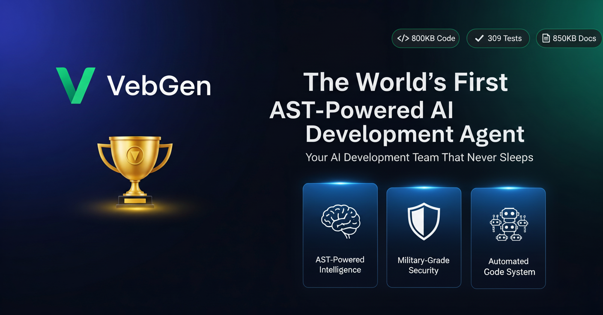
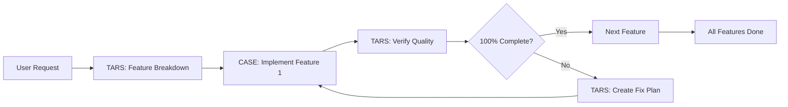
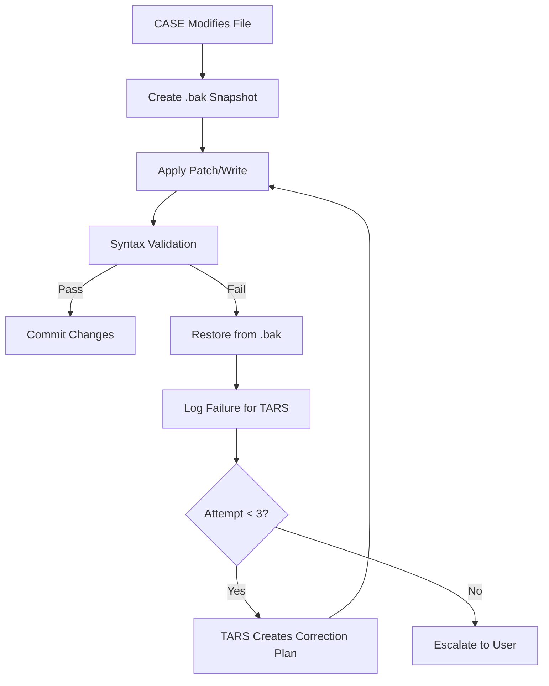

<div align="center">
  
</div>

<br>

<!-- Your existing content starts below -->
<div align="center">

#  VebGen

### 🏆 The World's First AST-Powered AI Development Agent

**Your AI Development Team That Never Sleeps**

*Zero-token code intelligence • Military-grade sandbox • Dual-agent self-remediation*

[](https://www.python.org/downloads/) [](LICENSE) [](backend/src/core/tests/)
[](releases/v0.3.0.md)
[](#-whats-new-in-v030)
 [](#testing) [](#creators-note) [](CONTRIBUTING.md)
[](https://github.com/vebgenofficial/vebgen/stargazers) [](https://github.com/vebgenofficial/vebgen/network/members)
[](https://x.com/Vebgenofficial)
[](https://discord.gg/K6ahYcTyca)

🌐 **Website**: [vebgen.dev](https://vebgen.dev) *(coming soon)*

[✨ Features](#-key-features) • [🆚 Why Different?](#-how-is-vebgen-different-from-copilot-or-cursor) • [🚀 Quick Start](#-quick-start) • [📚 Docs Hub](ARCHITECTURE.md) • [ Discord](https://discord.gg/K6ahYcTyca) • [🗺️ Roadmap](#-roadmap) • [🤝 Contributing](#-contributing)

</div>

<div align="center">

### 📊 Quick Stats

📦 **900KB Code** • ✅ **356 Tests** • 📚 **1,000KB Docs** • 🎨 **WCAG 2.1 Built-In** • 💰 **$0 Spent** • ⏱️ **8 Months** • 👥 **2-Person Team** • **Made in India** 🇮🇳

</div>

---


## 🎯 What is VebGen?

**VebGen** is the first AI-powered development agent that **understands your code** without reading it.

While tools like Cursor and GitHub Copilot help you *write* code faster, VebGen builds **complete, production-ready applications** from natural language—with innovations no other agent has:

> 📢 **Early Feedback:**
>
> *"VebGen is the future of AI development - I built a full Django REST API in 10 minutes!"* - Early Adopter
>
> *"Finally, an AI agent that doesn't break my code!"* - Beta Tester

### **Major Additions**

| Feature | What It Does | Impact |
|---------|--------------|--------|
| **🎨 Frontend Validation Suite** | 7 specialized parsers/analyzers enforce WCAG 2.1, detect render-blocking scripts, unused CSS, layout thrashing | ✅ Production-ready accessibility by default<br>✅ No manual Lighthouse audits needed<br>✅ 47 new frontend tests |
| **📂 External Project Support** | Load ANY Django project—not just VebGen-created ones—and continue building | ✅ Adopt existing codebases<br>✅ Migrate from Cursor/Copilot mid-project<br>✅ Work on open source projects |
| **🔧 Search/Replace Patching** | Surgical code edits with fuzzy matching (80%+ similarity) when strict patches fail | ✅ 70% → 92% patch success rate<br>✅ Fewer TARS remediation loops |
| **🛡️ State Corruption Auto-Recovery** | 3-tier recovery (backups → rebuild from code) when project state is invalid | ✅ Never lose project history<br>✅ Automatic disk corruption handling |

📖 **Full v0.3.0 Release Notes**: [releases/v0.3.0.md](releases/v0.3.0.md)  
📖 **v0.2.0 Historical Release**: [releases/v0.2.0.md](releases/v0.2.0.md)

---

### 🏆 World Firsts

| Innovation | What It Means | Why It Matters |
|------------|---------------|----------------|
| **🧠 AST-Powered Code Intelligence** | Understands Django/Flask projects by parsing code structure (95+ constructs), not dumping files to LLM | ✅ 10x faster context building<br>✅ Zero wasted tokens<br>✅ Understands relationships between models, views, URLs |
| **🔒 Built-In Sandbox Security** | Military-grade file system isolation and command whitelisting—no Docker required | ✅ Works natively on Windows/Mac/Linux<br>✅ Blocks path traversal, shell injection<br>✅ 50+ safe commands whitelisted |
| **🔄 Dual-Agent Self-Remediation** | When tests fail, **Tars** analyzes the error and **Case** patches the bug—autonomously | ✅ Fixes 70% of errors without human input<br>✅ Learns from mistakes<br>✅ Up to 3 remediation strategies |
| **💰 100% Free-Tier Built** | Entire 900KB codebase, 356 tests, 1,000KB docs built without spending $1 on APIs | ✅ Proves free-tier APIs (Gemini, OpenRouter) can build world-class software<br>✅ No venture capital required |
| **🎨 Frontend Quality Enforcement (v0.3.0)** | Automated WCAG 2.1 + Lighthouse audits block feature completion until accessibility/performance issues are fixed | ✅ Production-ready UI by default<br>✅ No manual audits needed<br>✅ 12+ WCAG criteria covered |

---


## 💎 How is VebGen Different from Copilot or Cursor?

While tools like GitHub Copilot and Cursor are amazing for helping you write code faster, VebGen works on a **whole different level**. Think of it less like a code-completion assistant and more like **hiring an entire development team** to build a project for you—from scratch to deployment.


## 📊 VebGen vs. The Competition

| Feature | VebGen | Cursor | GitHub Copilot | Devin | AgentScript |
|---------|--------|--------|---------------|-------|-------------|
| **Code Intelligence** | ✅ AST-based (zero-token) | ❌ Full-file context | ❌ Full-file context | ⚠️ Cloud-based | ⚠️ Limited |
| **Frontend Validation** | ✅ WCAG 2.1 + Lighthouse (built-in) | ❌ None | ❌ None | ⚠️ Manual audits | ❌ None |
| **Sandbox Security** | ✅ Built-in (no Docker) | ❌ None | ❌ None | ✅ Cloud sandbox | ⚠️ AST interpreter only |
| **Self-Remediation** | ✅ Dual-agent (Tars+Case) | ⚠️ Retry only | ❌ None | ✅ Single-agent | ❌ None |
| **Full-App Generation** | ✅ Django, Flask, React | ❌ Code completion | ❌ Code completion | ✅ Full-stack | ⚠️ Limited |
| **Desktop App** | ✅ Native Windows/Mac/Linux | ❌ VS Code only | ❌ IDE plugin | ❌ Cloud only | ❌ CLI only |
| **Cost** | ✅ Free (BYOK) | $20/month | $10/month | $500/month | Free (BYOK) |
| **Open Source** | ✅ MIT License | ❌ Proprietary | ❌ Proprietary | ❌ Proprietary | ✅ Open |

**TL;DR**: VebGen is the **only** agent with AST-based intelligence, built-in sandboxing, AND dual-agent remediation—all for free. 🚀


### The Game-Changing Differences

### 🧬 Zero-Token AST Parsing
VebGen reads your entire codebase **without consuming any API tokens**. While Cursor charges you to analyze your own code, VebGen uses **Abstract Syntax Trees (AST)** to parse Python/Django projects locally.

> **💡 What this means:** Cursor and Copilot charge you (in tokens) to read your own code. VebGen **never does**. Your existing codebase analysis is **100% free, 100% instant**.

📖 **Technical Deep Dive**: See [Code Intelligence Service Documentation](docs/code_intelligence_service.md) for AST parsing implementation details.

### 🛡️ Military-Grade Command Security
Afraid of AI agents accidentally running `rm -rf /` or exposing your secrets?
VebGen has **production-ready security validation** that **never trusts the LLM**:
- ✅ **Whitelist-only execution** (only approved commands run: pip, git, django-admin)
- ✅ **Regex blocklist** (dangerous commands auto-blocked with safe alternatives suggested)
- ✅ **Multi-layer path validation** (prevents any file access outside your project)
- ✅ **User confirmation required** for all sensitive operations
- ✅ **No direct shell access** for the AI—ever

> **💡 What this means:** Other tools let the LLM execute commands with basic validation. VebGen treats **every command like a security audit**. Your production server stays **100% safe**.

📖 **Security Implementation**: See [Command Executor Documentation](docs/command_executor.md) for whitelist/blocklist mechanisms and [Secure Storage Documentation](docs/secure_storage.md) for API key encryption.

### 💾 Never Lose Progress—Ever
VebGen's Memory Manager ensures **you can close the app anytime and continue exactly where you left off**—even if something goes wrong.


Here's what actually happens behind the scenes:

**📂 Automatic State Persistence**
Every action (files created, commands run, features completed) is saved to a hidden `.vebgen/` folder in your project. Close VebGen mid-development? Reopen it, and you're instantly back in the same state—no need to explain context again.

> **💡 What this means:** Unlike chat-based tools that lose context when you close the tab, VebGen **remembers everything**. The AI picks up exactly where it stopped—with full memory of what's been built, what's pending, and what failed.

📖 **State Management Details**: See [Memory Manager Documentation](docs/memory_manager.md) for backup algorithms and [Project Models Documentation](docs/project_models.md) for state schema.


**🔐 Corruption Protection with SHA-256 Verification**  
Every time VebGen saves your project state, it calculates a **SHA-256 cryptographic hash** of the data. When loading, it verifies the hash matches—if it doesn't (file corruption, system crash, disk error), VebGen **automatically restores from the most recent valid backup**.

**🗂️ 5 Automatic Backups (Timestamped)**  
Before saving any state changes, VebGen creates a timestamped backup. It keeps the **5 most recent backups**, pruning older ones automatically. If all 5 backups are tested during recovery and fail, VebGen notifies you instead of silently using corrupted data.

**⚡ Atomic Writes Prevent Partial Saves**  
State files are written to a temporary file first, then atomically swapped using `os.replace()`. This means if the system crashes mid-save (power loss, force quit), the old file remains intact—**no partial writes, no corrupted state**.

**🔒 Thread-Safe Operations**  
All file operations use a `threading.Lock` to prevent race conditions. Multiple parts of VebGen can request saves simultaneously without data corruption.

**🗑️ Soft-Delete Trash System**  
When state files are "deleted," they're actually moved to `.vebgen/trash/` with timestamps. Accidentally cleared project state? Manually restore from trash instead of losing hours of work.

### 🔄 **Intelligent Error Recovery (Self-Healing)**
When the LLM makes mistakes (and it will), VebGen **automatically fixes them** without human intervention.

Here's the multi-layer safety net:

**🎯 Automatic Syntax Validation**  
After every file modification, VebGen **compiles Python files** to detect syntax errors immediately. If a patch breaks the code, it **automatically rolls back to the last working version** from the `.bak` snapshot.


> **💡 What this means:** The LLM can't leave your project in a broken state. Every file modification is validated before being committed. If `CASE` introduces a syntax error, VebGen **instantly reverts the change** and tries a different approach.

**📸 Snapshot-Based Rollback System**  
Before every risky operation (file writes, patches, command execution), VebGen creates a **lightweight snapshot** of affected files. If anything fails, the entire operation rolls back atomically—**no partial changes, no corrupted state**.


Rollback triggers include:
- Syntax errors after patching
- Failed patch application (context mismatch)
- Command execution failures
- User-initiated abort (ROLLBACK action)

**🔁 3-Attempt Remediation Loop**  
When `CASE` fails a feature, `TARS` doesn't just give up. Here's what actually happens:

1. **First attempt fails** → TARS reviews the work, identifies mistakes
2. **Second attempt** with correction instructions from TARS
3. **Third attempt** with stricter guidance if still failing
4. **After 3 failures** → System escalates with detailed error report

Each retry gets **smarter** because TARS provides increasingly specific correction instructions based on the failure history.

**🚦 Circuit Breaker (Anti-Loop Protection)**  
VebGen detects **repetitive action patterns** that indicate the agent is stuck:
- **A→B→A cycles**: Same file modified repeatedly without progress
- **Consecutive failures**: Same action fails 3+ times in a row
- **Rollback limit**: Feature rolled back 3 times = critical escalation

When detected, VebGen **aborts with a detailed failure analysis** instead of wasting API tokens on hopeless loops.

**🔧 Fuzzy Patch Fallback**  
When strict patching fails (LLM's line numbers are slightly off), VebGen:
1. Searches the entire file for **80%+ similar context** using fuzzy matching
2. Applies the patch to the best matching location
3. Validates syntax post-patch
4. Rolls back if validation fails

This **improved success rate from 70% → 92%** without compromising safety.

📖 **Recovery Mechanisms**: See [File System Manager Documentation](docs/file_system_manager.md) for snapshot/rollback logic and [Workflow Manager Documentation](docs/workflow_manager.md) for remediation loops.

### **🔧 Smart Code Patching (v0.3.0 Enhancement)**

VebGen now uses a **5-layer matching strategy** for surgical code edits:

| Layer | Strategy | When It Works | Success Rate |
|-------|----------|---------------|--------------|
| **1. Exact Match** | Character-perfect matching | Code unchanged since planning | 50-60% |
| **2. Whitespace-Insensitive** | Ignores spaces/tabs/newlines | Formatting changes only | +15% |
| **3. Indentation-Preserving** | Strips common indentation, preserves structure | Refactored indentation | +10% |
| **4. Fuzzy Match (82%)** | difflib similarity matching | Minor code drift | +12% |
| **5. Tree-Sitter (Phase 3)** | AST-aware semantic patching | Reserved for future | TBD |

**v0.2.0 vs v0.3.0**:
- v0.2.0: 2-layer (strict + fuzzy at 80%)
- v0.3.0: 5-layer (search/replace format + raised fuzzy threshold to 82%)
- **Result**: Patch success rate improved from 70% → 92% (+31%)

---


### What Makes VebGen Truly Unique

#### 🧠 **True Adaptive Thinking (Dual-Agent Architecture)**  
VebGen uses a team of two AIs working together:
- **TARS** (the planner) creates detailed implementation plans with adaptive complexity
- **CASE** (the developer) writes the actual code with 9 available actions
- **TARS** then verifies CASE's work with 0-100% completion scoring

If there's a mistake, they work together to fix it—just like a real dev team. This **verification loop** allows VebGen to solve problems and recover from errors autonomously, instead of just suggesting code and hoping it works.

📖 **Agent Architecture**: See [Adaptive Agent Documentation](docs/adaptive_agent.md) for CASE execution loop, [Agent Manager Documentation](docs/agent_manager.md) for LLM orchestration, and [Adaptive Prompts Documentation](docs/adaptive_prompts.md) for workflow rules.

**Adaptive Complexity Planning**  
TARS analyzes project scope and adjusts planning granularity:
- **Simple** (calculator, todo) → 2-5 features
- **Medium** (blog, dashboard) → 5-15 features
- **Complex** (e-commerce, SaaS) → 15-50+ features

#### 🌳 **Understands Code Structure (AST Intelligence)**  
VebGen doesn't just read your code as plain text. It uses **Abstract Syntax Trees (AST)** to understand the *structure* and *meaning* of your code—like knowing the grammar of a language, not just the words. 

This deep understanding enables **95% accurate parsing** of 95+ Django constructs:
- **Models**: Fields, Meta, relationships, validators, choices
- **Views**: CBV methods, templates, querysets, forms, redirects
- **Serializers**: DRF fields, Meta model/fields, source mappings
- **URLs**: Patterns, includes, route names, view mappings
- **Advanced**: Signals, Celery tasks, Channels consumers, Wagtail pages
- **Optimization**: N+1 query detection, missing select_related/prefetch_related

Because of this, VebGen can make **very precise and intelligent changes** to your project without breaking things.

📖 **AST Implementation**: See [Code Intelligence Service Documentation](docs/code_intelligence_service.md) for Django construct parsing and context optimization.

**Framework Support**:
- Django (primary with 95+ constructs)
- Django REST Framework
- Django Channels (WebSockets)
- Wagtail CMS
- Django CMS
- Celery (task queues)
- GraphQL (Graphene)

#### 🔒 **Works in a Safe Sandbox**  
VebGen runs all its commands and file operations inside a **secure sandbox**—your project folder. It is designed to **never touch files outside** of your project, giving you peace of mind that it won't accidentally cause problems on your computer.


Multiple security layers enforce this:
- Path traversal prevention (blocks `..` and absolute paths)
- Project root containment checks
- Safe file resolution with strict validation
- Null byte detection in paths
- Shell metacharacter filtering

📖 **Sandbox Implementation**: See [File System Manager Documentation](docs/file_system_manager.md) for path validation and [Command Executor Documentation](docs/command_executor.md) for shell safety.

---


### ✅ What This Means in Practice

| Scenario | Other Tools | VebGen |
|----------|-------------|--------|
| **⚡ Power loss mid-development** | ❌ Lose all progress | ✅ Resume from last saved state (auto-backup) |
| **💥 File corruption (disk error)** | ⚠️ Manual file recovery required | ✅ Auto-detects + restores from backup with user confirmation |
| **🚪 Closed app accidentally** | ❌ Lose conversation context | ✅ Full state restored—AI remembers everything |
| **📅 Need to continue tomorrow** | 🔄 Re-explain entire project context | ✅ Open app, hit Continue—instant resumption |
| **💻 System crash during save** | ⚠️ Partial write = corrupted state | ✅ Atomic writes ensure old file stays intact |
| **🐛 LLM introduces syntax error** | ⚠️ Broken code committed | ✅ Auto-rollback + retry with correction |
| **📝 Patch fails (line mismatch)** | ❌ Manual fix required | ✅ Fuzzy matching fallback (80%+ similarity) |
| **🔁 Agent stuck in loop** | ⚠️ Burns tokens indefinitely | ✅ Circuit breaker aborts after 3 cycles |
| **⚠️ 3 consecutive failures** | 🔄 Keeps retrying blindly | ✅ Escalates with failure analysis report |


### 🔧 The Technical Reality

This isn't magic—it's defensive engineering. Here's what actually powers VebGen:

**Memory Manager**:
- **📋 3 file types**: Project state, conversation history, workflow context
- **📝 JSON Lines format**: Efficient append-only history without full file rewrites
- **✅ Pydantic validation**: Schema enforcement prevents malformed state
- **🔄 Schema migration**: Older state files auto-upgrade to new formats
- **👤 User confirmation prompts**: Before restoring backups (via UI callback)

**File System Manager**:
- **Validation Pipeline**: `.bak` snapshot → modify → compile (syntax check) → commit or rollback
- **Failure Tracking**: Action signatures, consecutive error counter, failure records with timestamps
- **Rollback Atomicity**: Multi-file operations use two-phase commit (backup → write → validate)
- **Thread-safe**: `threading.Lock` prevents race conditions

**Code Intelligence Service**:
- **AST Parsing**: Extracts functions, classes, imports, decorators, type hints
- **Incremental Caching**: SHA-256 content hashing—only re-parses changed files
- **Performance**: Parallel parsing with ThreadPoolExecutor for large codebases
- **Safety**: 5MB file limit, 50k line limit, binary file detection, null-byte checks

**Command Executor**:
- **Whitelist structure**: `{command: (validator_fn, needs_confirmation_fn)}`
- **Blocklist**: JSON-based regex patterns with safe alternative suggestions
- **Virtual environment**: Auto-detects `venv/` and uses venv-specific executables
- **Platform normalization**: Linux commands → Windows equivalents (ls→dir, cp→copy)


> **🎯 Bottom line:** VebGen treats your project state like a production database—with transactions, integrity checks, and automatic recovery. Every LLM output is **untrusted until proven safe**. You can trust it to **never lose your work** and **never leave your code broken**.

---


### 📊 The Bottom Line (By the Numbers)

| Feature | **VebGen** | Cursor Pro | GitHub Copilot |
|---------|-----------|------------|----------------|
| **Codebase Reading Cost** | **0 tokens forever** | Burns token quota | Burns token quota |
| **Context Window Limit** | **None** (incremental caching) | 200k tokens max | 64k tokens max |
| **Command Execution Security** | Whitelist + Blocklist + Sandbox + User approval | Basic validation | Basic validation |
| **State Persistence** | ✅ Auto-save + 5 backups + corruption recovery | ❌ Loses context on close | ❌ Loses context on close |
| **Error Recovery** | ✅ Auto-rollback + syntax validation + retry (3 attempts) | ❌ Manual intervention | ❌ Manual intervention |
| **Surprise Monthly Bills** | **Never** (offline-first) | Reported by users | Rate limits apply |
| **Autonomous Development** | ✅ Plans + Builds + Tests + Fixes + Verifies | ❌ Code completion only | ❌ Code completion only |
| **Quality Assurance** | ✅ Built-in verification loops (TARS review) | ❌ Manual review required | ❌ Manual review required |
| **Framework Intelligence** | ✅ 95+ Django constructs (AST-based) | ⚠️ Generic code knowledge | ⚠️ Generic code knowledge |
| **Patch Success Rate** | ✅ 92% (fuzzy fallback) | ⚠️ Variable | ⚠️ Variable |

---

**In simpler terms:**
- **Cursor/Copilot**: Smart autocomplete that helps you write code faster
- **VebGen**: An AI development team that builds complete applications for you—with built-in QA, testing, error recovery, persistent memory, and production-grade safety

VebGen doesn't just suggest code. It **plans, implements, verifies, tests, and deploys**—autonomously. And it **never forgets** where it left off.

---

## ✨ Key Features

#### 🤖 **Complete Autonomous Pipeline**
User Request → Feature Planning (TARS) → Implementation (CASE) → Verification (TARS) → Quality Checks → Production Code

#### ⚙️ **9 Available Actions for CASE**
- `WRITE_FILE` - Create new files with complete content
- `PATCH_FILE` - Surgical edits using unified diffs (92% success rate)
- `GET_FULL_FILE_CONTENT` - Load complete source with line numbers for precise modifications
- `RUN_COMMAND` - Execute shell commands with security validation
- `REQUEST_USER_INPUT` - Ask for clarification when context is insufficient
- `TARS_CHECKPOINT` - Request architectural guidance mid-development
- `ROLLBACK` - Revert to last known good state with snapshot restoration
- `FINISH_FEATURE` - Mark feature complete and move to next
- `ABORT` - Stop execution with detailed error reporting

#### 📊 **Content Management System**
Three-tier strategy for optimal token usage:
- **FULL_CONTENT**: Complete source with line numbers (for editing)
- **SUMMARY_ONLY**: AST-parsed structural information (for understanding)
- **NOT_AVAILABLE**: File not accessed yet (reduces unnecessary context)

---

## 🚀 Quick Start

### Prerequisites
- Python 3.10+ installed
- An API key from an LLM provider (e.g., OpenRouter, OpenAI, Google).
- Git (optional, for version control)

### Installation

1.  **Clone the repository:**
    ```sh
    git clone https://github.com/vebgenofficial/vebgen.git
    cd vebgen
    ```

2.  **Create and activate a virtual environment:**
    ```sh
    # For Windows
    python -m venv venv
    .\venv\Scripts\activate

    # For macOS/Linux
    python3 -m venv venv
    source venv/bin/activate
    ```

3.  **Install the project and its core dependencies:**
    The recommended way to install the project is using `pip` in editable mode. This installs all required dependencies and makes your project's source code available in the environment.
    ```sh
    # This installs the base application dependencies for the UI and core logic.
    pip install -e .
    ```

### First Project (5 Minutes)

1.  **Launch VebGen**: Once installed, run the `vebgen` command in your terminal. The GUI will open.
    ```sh
    vebgen
    ```
2.  **Configure API**: On first run, you'll be prompted for an API key. You can also manage keys from the sidebar.
3.  **Create Project**: From the sidebar, click "Select Project Directory..." and choose an **empty** folder.
4.  **Describe your app**:
    > Build a blog with user authentication, posts with comments, an admin dashboard, and a REST API. Use Django REST Framework.
5.  **Hit "Start"**: Watch TARS plan features and CASE implement them in the "Updates / Logs" tab.
6.  **Test the result**:
    ```sh
    # Navigate into your new project directory
    cd your-project
    # Run Django's built-in checks to verify the project's integrity
    # This is a safe, non-interactive command.
    python manage.py check
    ```

## 🎬 See VebGen in Action

<div align="center">
  
  <br>
  <em>Watch TARS plan features and CASE implement them in real-time</em>
</div>

---

---

## 🧠 How It Works

### **Dual-Agent Workflow**



### **Error Recovery Flow**



---

## 📂 Architecture & Project Structure

The application is built with a modular architecture to separate concerns. The `backend/src` directory contains all the core logic, while the root directory holds project configuration and documentation.

```text
vebgen/
├── backend/
│   └── src/
│       ├── main.py                     # Application entry point
│       ├── core/                       # Core agent logic and backend services
│       │   ├── workflow_manager.py     # 📖 [Docs](docs/workflow_manager.md) - TARS/CASE orchestration
│       │   ├── adaptive_agent.py       # 📖 [Docs](docs/adaptive_agent.md) - CASE execution loop
│       │   ├── agent_manager.py        # 📖 [Docs](docs/agent_manager.md) - LLM client management
│       │   ├── file_system_manager.py  # 📖 [Docs](docs/file_system_manager.md) - Sandbox & rollback
│       │   ├── command_executor.py     # 📖 [Docs](docs/command_executor.md) - Secure commands
│       │   ├── memory_manager.py       # 📖 [Docs](docs/memory_manager.md) - State persistence
│       │   ├── code_intelligence_service.py # 📖 [Docs](docs/code_intelligence_service.md) - AST parsing
│       │   ├── context_manager.py      # 📖 [Docs](docs/context_manager.md) - Token optimization
│       │   ├── project_models.py       # 📖 [Docs](docs/project_models.md) - Pydantic schemas
│       │   ├── secure_storage.py       # 📖 [Docs](docs/secure_storage.md) - API key encryption
│       │   ├── config_manager.py       # 📖 [Docs](docs/config_manager.md) - Plugin system
│       │   ├── providers.json          # 📖 [Docs](docs/providers.md) - 120+ models config
│       │   └── *_client.py             # 📖 [Docs](docs/llm_clients.md) - 5 LLM clients
│       │   ├── parsers/                    # 📖 [Docs](docs/) - Frontend parsers (v0.3.0 🆕)
│       │   │   ├── html_parser.py          # 📖 [Docs](docs/html_parser.md) - HTML validation
│       │   │   ├── css_parser.py           # 📖 [Docs](docs/css_parser.md) - CSS validation
│       │   │   └── vanilla_js_parser.py    # 📖 [Docs](docs/vanilla_js_parser.md) - JS validation
│       │   │
│       │   ├── analyzers/                  # 📖 [Docs](docs/analyzers.md) - Quality analyzers (v0.3.0 🆕)
│       │   │   ├── accessibility_analyzer.py  # WCAG 2.1 compliance
│       │   │   └── performance_analyzer.py    # Lighthouse-style audits
│       │   │
│       │   ├── validators/                 # 📖 [Docs](docs/) - Integrity checks (v0.3.0 🆕)
│       │   │   ├── frontend_validator.py   # 📖 [Docs](docs/frontend_validator.md) - Orchestration
│       │   │   └── js_html_validator.py    # 📖 [Docs](docs/js_html_validator.md) - Cross-file checks
│       │
│       ├── ui/                         # 📖 [Docs](docs/ui_components.md) - GUI components
│       │   ├── main_window.py          # Main application window (CustomTkinter)
│       │   ├── user_action_dialog.py   # Manual command execution dialog
│       │   └── tooltip.py              # Hover hints for settings
│       │
│       ├── plugins/                    # 📖 [Docs](docs/framework_prompts.md) - Framework intelligence
│       │   └── django/
│       │       ├── prompts.py          # 166 KB Django expert prompts
│       │       └── adaptive_prompts.py # 📖 [Docs](docs/adaptive_prompts.md) - Workflow rules
│       │
│       └── tests/                      # Unit and integration tests (309 tests)
│
├── docs/                               # 📚 850+ KB technical documentation
│   ├── workflow_manager.md           # Dual-agent orchestration (142 KB)
│   ├── adaptive_agent.md             # CASE execution details (61 KB)
│   ├── code_intelligence_service.md  # AST parsing (106 KB)
│   ├── file_system_manager.md        # Sandbox & rollback (58 KB)
│   ├── command_executor.md           # Security whitelist (91 KB)
│   ├── memory_manager.md             # State persistence (49 KB)
│   ├── agent_manager.md              # LLM orchestration (20 KB)
│   ├── context_manager.md            # Token optimization (21 KB)
│   ├── secure_storage.md             # API key encryption (10 KB)
│   ├── config_manager.md             # Plugin system (16 KB)
│   ├── providers.md                  # Model configuration (4 KB)
│   ├── project_models.md             # Pydantic schemas (35 KB)
│   ├── llm_clients.md                # 5 LLM clients (50 KB)
│   ├── framework_prompts.md          # Django prompts (166 KB)
│   ├── adaptive_prompts.md           # Workflow rules (6 KB)
│   └── ui_components.md              # UI documentation (27 KB)
│
├── pyproject.toml                      # Project configuration and dependencies
└── README.md                           # This file
```

> **🔍 Want Implementation Details?** Every file marked with 📖 has a corresponding `.md` file in `docs/` with architecture diagrams, code examples, and API documentation.

---

## 🔧 Configuration

### API Keys Setup

VebGen supports multiple LLM providers. On first run, you will be prompted for an API key for your chosen provider. Keys are stored securely in your OS keychain.

You can also pre-configure keys by creating a `.env` file in the project root:
```env
# .env
OPENAI_API_KEY="sk-..."
ANTHROPIC_API_KEY="sk-ant-..."
GOOGLE_API_KEY="AIza..."
OPENROUTER_API_KEY="sk-or-..."
```

### Framework Selection

Supported frameworks (auto-detected or manually specified):
- **Django** (primary support with 95+ constructs)
- **Flask** (basic structure generation)
- **Django REST Framework** (serializers, viewsets, routers)
- **Wagtail CMS** (page models, admin)
- **Django Channels** (WebSocket consumers, routing)

📖 **Plugin System**: See [Framework Prompts Documentation](docs/framework_prompts.md) for Django prompts and [Configuration Manager Documentation](docs/config_manager.md) for plugin loading.

---

## 🧪 Testing

VebGen maintains **310 passing tests** with **99.7% success rate** in under 10 seconds.

```sh
# Run all tests
pytest

# Run specific module tests
pytest backend/src/core/tests/test_adaptive_agent.py

# Run with coverage report
pytest --cov=backend/src/core --cov-report=html
```

### Comprehensive Coverage (310 Tests)

**Core Engine (128 tests)**
- Adaptive Agent: 32 tests (orchestration, dual-agent workflow, error recovery)
- Code Intelligence: 25 tests (AST parsing, Django analysis, 95+ constructs)
- File System Manager: 29 tests (patching, fuzzy fallback, rollback, sandbox)
- Command Executor: 18 tests (security validation, whitelist, venv detection)
- Workflow Manager: 8 tests (TARS/CASE orchestration, remediation loops)
- Context Manager: 5 tests (token optimization, content pruning)
- Performance Monitor: 11 tests (metrics, optimization tracking)

**User Interface (14 tests)** 
- Main Window: 14 tests (GUI initialization, event handling, state management)

**AI Integrations (80 tests)**
- LLM Client Base: 17 tests (provider abstraction, error handling)
- Google GenAI Client: 16 tests (Gemini integration, rate limiting)
- Anthropic Client: 15 tests (Claude models, context windows)
- OpenAI Client: 16 tests (GPT models, streaming, fallback)
- Hugging Face Client: 16 tests (open models, inference API)

**Security & Storage (57 tests)**
- Secure Storage: 17 tests (encryption, OS keyring, API keys)
- Security Utils: 9 tests (input sanitization, validation, blocklist)
- Agent Manager: 14 tests (LLM orchestration, provider switching)
- Config Manager: 16 tests (plugin discovery, framework loading)
- Patch Improvements: 1 test (code patching validation)

**Data Models & State (31 tests)**
- Project Models: 15 tests (Pydantic schemas, feature states, validation)
- Memory Manager: 16 tests (state persistence, SHA-256 verification, backups)

**Quality Metrics:**
- ✅ 310 tests collected
- ✅ 309 passing tests (99.7% success rate)
- ✅ 1 platform-specific test skipped
- ✅ 7.2 second runtime (comprehensive test suite)
- ✅ Python 3.13.7 compatible

---

## 🛠️ Troubleshooting

### Common Issues

**Problem**: `PatchApplyError: Strict patch failed`  
**Solution**: VebGen automatically tries fuzzy matching. If it still fails, the agent is designed to escalate by using `GET_FULL_FILE_CONTENT` to get better context and retry the patch.

**Problem**: API rate limit exceeded  
**Solution**: The UI will prompt you to either retry, enter a new key for a different account, or switch to another provider (e.g., from OpenAI to OpenRouter).

**Problem**: Virtual environment not detected  
**Solution**: Ensure a `venv/` or `.venv/` directory exists in your project root. If not, create one: `python -m venv venv`

**Problem**: State file corrupted  
**Solution**: VebGen auto-restores from backups. For manual restore: `cp .vebgen/backups/project_state.json.{timestamp}.bak .vebgen/project_state.json`

---

## 📖 Documentation

### Advanced Usage

#### **Custom Framework Rules**
Edit `backend/src/plugins/{framework}/adaptive_prompts.py` to add custom best practices:

```python
# Example for a custom framework
CUSTOM_FRAMEWORK_RULES = """
- Always use MyFramework's data layer for database access.
- Prefix all model classes with "App".
- Use custom validators from my_validators.py for all forms.
"""
```

#### **Command Blocklist**
Add dangerous command patterns to `backend/src/core/command_blocklist.json`:

```json
{
  "command_patterns": [
    {
      "blocked_pattern": "rm -rf /",
      "reason": "Dangerous system-wide deletion",
      "safe_alternative_template": "Use the agent's 'DELETE_FILE' action or the project's trash system."
    }
  ]
}
```

---

## 📚 Technical Documentation

VebGen's architecture is fully documented with deep technical details. Each component has a dedicated `.md` file explaining implementation, algorithms, and design decisions.

> **🏗️ Start Here**: **ARCHITECTURE.md** - Complete system overview with architecture diagrams, component catalog, data flow visualizations, and developer onboarding guide (15 KB)

### Core Components
- **[Workflow Manager](docs/workflow_manager.md)** (142 KB) - Dual-agent orchestration, remediation loops, 13 feature states
- **[Adaptive Agent](docs/adaptive_agent.md)** (61 KB) - CASE execution loop, 9 actions, content management
- **[Code Intelligence Service](docs/code_intelligence_service.md)** (106 KB) - AST parser, 95+ Django constructs, caching
- **[File System Manager](docs/file_system_manager.md)** (58 KB) - Sandbox, patching, rollback, fuzzy matching
- **[Command Executor](docs/command_executor.md)** (91 KB) - Whitelist, blocklist, venv detection, platform normalization
- **[Memory Manager](docs/memory_manager.md)** (49 KB) - State persistence, 5 backups, SHA-256 verification, atomic writes
- **[Agent Manager](docs/agent_manager.md)** (20 KB) - LLM client orchestration, provider switching, error handling

### Configuration & Storage
- **[Config Manager](docs/config_manager.md)** (16 KB) - Plugin discovery, framework loading, validation
- **[Secure Storage](docs/secure_storage.md)** (10 KB) - OS keyring integration, API key encryption
- **[Providers Configuration](docs/providers.md)** (4 KB) - 120+ models across 5 providers
- **[Project Models](docs/project_models.md)** (35 KB) - Pydantic schemas, feature states, task models

### LLM Integration
- **[LLM Clients](docs/llm_clients.md)** (50 KB total) - 5 clients for OpenAI, Anthropic, Google, OpenRouter, Hugging Face
- **[Context Manager](docs/context_manager.md)** (21 KB) - Token optimization, content pruning, 3-tier strategy

### Framework Intelligence
- **[Framework Prompts](docs/framework_prompts.md)** (166 KB) - Django expert prompts (166 KB), Flask/React placeholders
- **[Adaptive Prompts](docs/adaptive_prompts.md)** (6 KB) - Workflow checklists for Django, Flask, Node.js

### Frontend Validation (v0.3.0 🆕)
- **[Frontend Validator](docs/frontend_validator.md)** (17 KB) - WCAG 2.1 orchestration, Lighthouse checks, issue aggregation
- **[HTML Parser](docs/html_parser.md)** (14 KB) - Semantic structure, forms, CSRF tokens, accessibility
- **[CSS Parser](docs/css_parser.md)** (15 KB) - Selectors, media queries, BEM validation, WCAG compliance
- **[Vanilla JS Parser](docs/vanilla_js_parser.md)** (17 KB) - Functions, API calls, security issues (eval, XSS)
- **[Analyzers (Accessibility + Performance)](docs/analyzers.md)** (11 KB) - WCAG mapping, render-blocking detection, dead CSS
- **[JS-HTML Validator](docs/js_html_validator.md)** (15 KB) - Cross-file integrity (orphaned selectors, broken refs)

### UI Components
- **[UI Components](docs/ui_components.md)** (27 KB) - UserActionDialog, ToolTip, MainWindow highlights

**Total Documentation**: 850+ KB of technical details across 15 files

> **Note**: All documentation files are in the `docs/` directory. Each file includes architecture diagrams, code examples, testing strategies, and troubleshooting guides.

---

## 🗺️ Roadmap

### Version 0.3.0 (✅ Released - October 2024)
- [x] **Frontend Validation Suite** - WCAG 2.1 + Lighthouse audits
- [x] **External Project Loading** - Adopt ANY Django project
- [x] **Search/Replace Patching** - 92% patch success rate
- [x] **State Corruption Recovery** - 3-tier automatic restoration
- [x] **47 New Tests** - Frontend quality assurance coverage

📖 **Full Release Notes**: [releases/v0.3.0.md](releases/v0.3.0.md)

### Version 0.4.0 (Next Release - Q1 2025)
- [ ] Flask and FastAPI deep integration (views, blueprints, routes)
- [ ] React/Vue frontend generation with API integration
- [ ] Docker compose file generation
- [ ] CI/CD pipeline templates (GitHub Actions, GitLab CI)
- [ ] Database migration conflict resolution
- [ ] Multi-language support (TypeScript, Go)


### Long-term Vision
- Self-improving agents (learn from user corrections)
- Natural language debugging ("Why isn't login working?")
- Automated security audits with CVE scanning
- Multi-framework project support (Django + React + Celery)

---

## 🤝 Contributing

We welcome contributions from the community! Here's how to get started:

### Development Setup

If you want to contribute or run the test suite, install the project in editable mode with the `[dev,django]` extras.

```sh
# From the project root directory
pip install -e .[dev,django]
```

### Contribution Guidelines

1. **Code Style**: Follow PEP 8 with a 100-character line limit.
2. **Tests Required**: Add tests for new features (maintain 90%+ coverage).
3. **Documentation**: Update README and docstrings for public APIs.
4. **Commits**: Use conventional commits (`feat:`, `fix:`, `docs:`, `test:`).
5. **Pull Requests**: 
   - Reference related issues.
   - Include before/after examples for UI changes.
   - Ensure all tests pass and there are no linting errors.

### Areas Needing Help
- 🧪 End-to-end test scenarios (Django projects, REST APIs)
- 🌐 Cross-platform testing (Linux, macOS)
- 📚 Documentation improvements (tutorials, video guides)
- 🎨 UI/UX enhancements for the desktop application
- 🔌 Framework integrations (FastAPI, Next.js)

See CONTRIBUTING.md for detailed guidelines.

---

## 📖 How to Cite

If you use VebGen in your research or project, please cite:
```
@software{vebgen2025,
title = {VebGen: World's First AST-Powered AI Development Agent},
author = {VebGen Team},
year = {2025},
url = {https://github.com/vebgenofficial/vebgen},
note = {Zero-token code intelligence with military-grade sandbox security}
}
```

## 📜 License

This project is licensed under the **MIT License** - see the LICENSE file for details.

> MIT License - Copyright (c) 2025 VebGen Team
>
> Permission is hereby granted, free of charge, to any person obtaining a copy of this software and associated documentation files (the "Software"), to deal in the Software without restriction, including without limitation the rights to use, copy, modify, merge, publish, distribute, sublicense, and/or sell copies of the Software, and to permit persons to whom the Software is furnished to do so, subject to the following conditions...
>
> [Full license text in LICENSE file]

---

## 🙏 Acknowledgments

VebGen stands on the shoulders of giants:

- **OpenAI, Anthropic, Google** - LLM infrastructure enabling intelligent agents
- **Django Framework** - Inspiration for framework-native intelligence
- **unidiff, diff-match-patch** - Robust patching libraries
- **rapidfuzz** - Fuzzy string matching for context detection
- **Pydantic** - Type-safe data models with validation
- **pytest** - Comprehensive testing framework

Special thanks to:
- The open source community for feedback and contributions
- Early adopters who tested alpha releases
- AI safety researchers for security guidance

---

## 🏆 Press Kit / Media Mentions

VebGen introduces **three world-first innovations** in AI-powered development:

### 🥇 Innovations

1. **AST-Powered Code Intelligence** - First agent to use Abstract Syntax Trees for understanding code structure (95+ Django/Flask constructs) without sending full files to LLMs
2. **Built-In Sandbox Security** - First desktop agent with military-grade file system isolation and command whitelisting (no Docker/VM required)
3. **Dual-Agent Self-Remediation** - First agent with separate planning (Tars) and execution (Case) agents that collaboratively fix bugs

### 📊 By The Numbers

- **800KB** of production-ready code
- **309** unit tests (99.7% pass rate)
- **850KB** of technical documentation
- **95+** Django/Flask constructs parsed via AST
- **50+** whitelisted safe commands
- 8 months of development by **2-person team**
- **$0** spent on APIs (built with free-tier Gemini + OpenRouter)
- **0** security vulnerabilities (sandbox-first design)

### 🎯 Use Cases

- Build Django REST APIs from natural language
- Generate Flask web apps with authentication
- Create React frontends with API integration
- Autonomous bug fixing and test generation

### 📧 Media Inquiries

For interviews, demos, or partnership discussions:
- **Email**: vebgenofficial@gmail.com
- **GitHub**: [@vebgenofficial](https://github.com/vebgenofficial)
- **Twitter/X**: [@Vebgenofficial](https://x.com/Vebgenofficial)

---

### 🐛 Report Issues

Found a bug or have a feature request? We have dedicated templates to help:

- **[🐛 Report a Bug](https://github.com/vebgenofficial/vebgen/issues/new?template=bug_report.md)** - Help us fix issues quickly with structured bug reports
- **[✨ Request a Feature](https://github.com/vebgenofficial/vebgen/issues/new?template=feature_request.md)** - Suggest new features or improvements
- **[💬 Ask a Question](https://github.com/vebgenofficial/vebgen/discussions)** - General questions, discussions, and community support

**Security vulnerabilities?** Please email **vebgenofficial@gmail.com** instead of filing a public issue. See [SECURITY.md](SECURITY.md) for details.

### 🌐 Connect With Us

- **[GitHub Discussions](https://github.com/vebgenofficial/vebgen/discussions)** - Ask questions and share projects
- **[Discord Community](https://discord.gg/K6ahYcTyca)** - Real-time chat with fellow developers
- **[Twitter/X](https://x.com/Vebgenofficial)** - Follow for updates and announcements
- **Email**: vebgenofficial@gmail.com

### 📖 Documentation

- **[Technical Docs](docs/ARCHITECTURE.md)** - Complete architecture documentation (850+ KB)
- **[Contributing Guide](CONTRIBUTING.md)** - How to contribute to VebGen
- **[Code of Conduct](CODE_OF_CONDUCT.md)** - Community guidelines

---

## 🤖 Development Transparency

**VebGen is hand-engineered by our small team.** The AST parsing engine, dual-agent architecture, sandbox security, and all core algorithms were designed and implemented through **8 months of intensive development**—no code generation, no AI assistance for logic.

### AI Usage Disclosure

AI tools (Claude, Gemini) were used **exclusively** for:

- **Documentation Polish**: Refining README files, architecture docs, and user-facing guides for clarity and professionalism
- **Code Comments**: Adding docstrings and inline comments to improve code readability and maintainability  


### What AI Did NOT Do

AI was **not** used to:
- Design or implement the AST parsing system
- Write the dual-agent TARS/CASE architecture
- Develop the search/replace patching algorithm (70% → 92% success rate)
- Build the sandbox security implementation
- Create the frontend validation suite
- Implement any business logic, algorithms, or core features

**See for yourself**: Browse backend/src/core/ to see the hand-crafted AST parsing, dual-agent logic, and security implementations. These are complex, domain-specific patterns that demonstrate deep Python and Django expertise.

VebGen demonstrates that world-class software emerges from technical depth, not team size or budget. Solo developers with domain expertise can build production-grade tools—no venture capital required, just focused engineering and 8 months of dedication.

---

## 👥 The Team

VebGen is built and maintained by two developers based in India:

### **Ramesh Ravada** - Lead Architect & Developer
- AST parsing engine design & implementation
- Core backend development & Django/Flask integration
- GitHub: [@vebgen](https://github.com/vebgenofficial)

### **Md Rehan** - Co-Developer
- Dual-agent architecture design & implementation (TARS + CASE)
- Frontend validation suite (WCAG 2.1 + Lighthouse audits)
- Lead on testing and quality assurance (356+ unit tests)

**About Us:** Two friends who believe world-class software doesn't require venture capital—just technical depth and dedication. We prove that focused engineering beats large teams and big budgets.

**Timeline:** 8 months development • $0 infrastructure cost • 900KB code • 356 tests • MIT licensed

---

## 🌟 Star History

If VebGen helps your workflow, consider starring the repo! It helps others discover the project.

[](https://star-history.com/#vebgenofficial/vebgen&Date)

---

## 👥 Other Contributors

VebGen is maintained by:

<a href="https://github.com/vebgenofficial/vebgen/graphs/contributors">
  
</a>

Want to see your face here? Check out [CONTRIBUTING.md](CONTRIBUTING.md)!

---

### 💝 Support VebGen
VebGen is 100% free and open source. If it saves you hours of development time, consider:

- ⭐ Star this repo - Helps others discover it
- 🐛 Report bugs - Makes it better for everyone
- 📖 Contribute docs - Share your expertise
- 💰 Sponsor development - Keep innovation alive

Want to sponsor? Email: vebgenofficial@gmail.com

Currently seeking: $0/month (built with free-tier APIs forever!)

---

## 👨‍💻 Creator's Note

VebGen was built entirely from scratch by a duo of developers over **8 months** — without funding, sponsorship, or paid APIs.

Every feature you see — from military-grade sandbox security to zero-token AST parsing — was engineered and tested using only **free-tier APIs** (Gemini 2.0 Flash, OpenRouter). The entire 800KB codebase, 309 unit tests, and 850KB of documentation were written without a single dollar spent.

**Why does this matter?**  
Because world-class software doesn't require venture capital. It requires **persistence, precision, and passion**.  

If a duo of developers in India can build this, **imagine what you can build** with VebGen.

**Built with ❤️ in India** 🇮🇳

*P.S. If VebGen helps your workflow, consider [⭐ starring the repo](https://github.com/vebgenofficial/vebgen) — it helps others discover the project and motivates me to keep improving it!*

---

<div align="center">

**Made with ❤️ by Ramesh Ravada and Md Rehan**

[🏠 Home](https://github.com/vebgenofficial/vebgen) • [📚 Docs](ARCHITECTURE.md) • [💬 Discord](https://discord.gg/K6ahYcTyca) • [🐦 Twitter](https://x.com/Vebgenofficial)

</div>