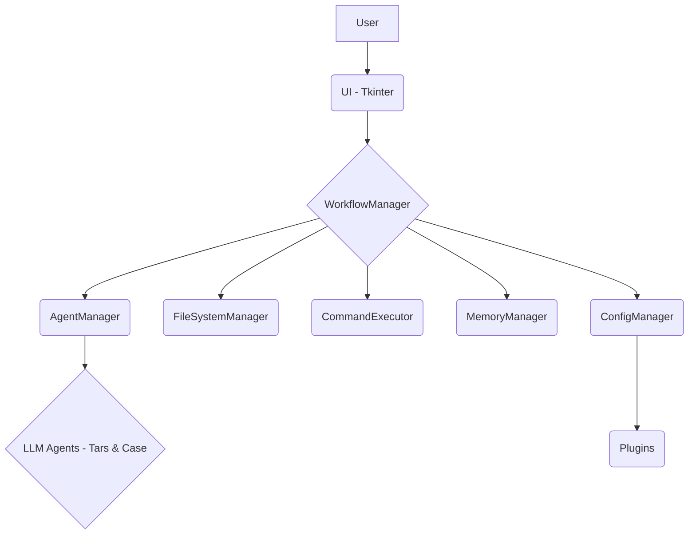

# Architecture

This diagram provides a high-level overview of the Vebgen AI Agent's architecture.

```mermaid
graph TD
    A[User] --> B(UI - Tkinter);
    B --> C{WorkflowManager};
    C --> D(AgentManager);
    D --> E{LLM Agents - Tars & Case};
    C --> F(FileSystemManager);
    C --> G(CommandExecutor);
    C --> H(MemoryManager);
    C --> I(ConfigManager);
    I --> J(Plugins);
```
